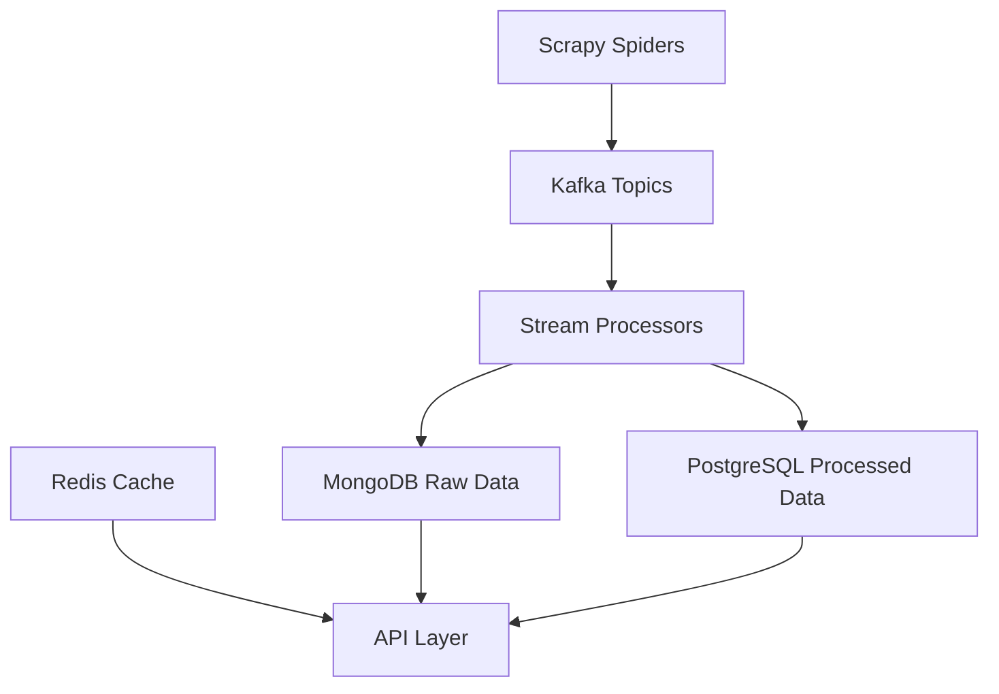

# CI/CD Pipeline for Data Processing Infrastructure


A comprehensive CI/CD pipeline specifically designed for deploying and managing distributed data processing systems, with focus on web scraping, data streaming, and database management.

## 📋 Table of Contents
- [CI/CD Pipeline for Data Processing Infrastructure](#cicd-pipeline-for-data-processing-infrastructure)
  - [📋 Table of Contents](#-table-of-contents)
  - [🎯 Features](#-features)
    - [Data Pipeline Components](#data-pipeline-components)
    - [CI/CD Features](#cicd-features)
  - [📁 Project Structure](#-project-structure)
  - [🏗 Architecture](#-architecture)
  - [📝 Prerequisites](#-prerequisites)
  - [🚀 Getting Started](#-getting-started)
  - [⚙️ Configuration Examples](#️-configuration-examples)
    - [Scrapy Settings](#scrapy-settings)
    - [MongoDB Configuration](#mongodb-configuration)
    - [Kafka Topics](#kafka-topics)
    - [PostgreSQL Schema](#postgresql-schema)
  - [🔄 Deployment Configurations](#-deployment-configurations)
    - [Scrapy Deployment](#scrapy-deployment)
    - [Stream Processor Deployment](#stream-processor-deployment)
  - [📊 Monitoring Setup](#-monitoring-setup)
    - [Pipeline Metrics](#pipeline-metrics)
    - [Grafana Dashboard Example](#grafana-dashboard-example)
  - [🔧 Local Development](#-local-development)
  - [🔍 Troubleshooting](#-troubleshooting)
    - [Common Issues](#common-issues)
  - [📄 License](#-license)

## 🎯 Features

### Data Pipeline Components
- Scrapy spiders with auto-scaling capabilities
- Kafka streaming for real-time data processing
- MongoDB for raw data storage
- PostgreSQL for processed/analyzed data
- Redis for caching and job queues
- API endpoints for data access and monitoring

### CI/CD Features
- Automated testing for data pipelines
- Docker containerization with volume management
- Kubernetes orchestration for distributed systems
- Multiple environment configurations
- Database migration automation
- Monitoring for data quality and pipeline health
- Backup and recovery procedures

## 📁 Project Structure

```
data-pipeline-deployment/
├── scraping/
│   ├── spiders/
│   │   ├── base_spider.py
│   │   └── specific_spiders/
│   ├── middlewares/
│   ├── pipelines/
│   └── settings/
├── streaming/
│   ├── kafka_producers/
│   ├── kafka_consumers/
│   └── stream_processors/
├── storage/
│   ├── mongodb/
│   │   ├── schemas/
│   │   └── indexes/
│   ├── postgresql/
│   │   ├── migrations/
│   │   └── models/
│   └── redis/
│       └── cache_configs/
├── api/
│   ├── endpoints/
│   ├── models/
│   └── services/
├── pipeline/
│   ├── github_actions/
│   │   ├── test_pipeline.yml
│   │   └── deploy_pipeline.yml
│   └── scripts/
│       ├── health_checks.sh
│       └── rollback.sh
├── kubernetes/
│   ├── scrapy/
│   │   ├── deployment.yaml
│   │   └── scaler.yaml
│   ├── kafka/
│   │   ├── statefulset.yaml
│   │   └── service.yaml
│   ├── mongodb/
│   ├── postgresql/
│   └── redis/
├── monitoring/
│   ├── prometheus/
│   │   └── scraping_metrics.yaml
│   ├── grafana/
│   │   └── dashboards/
│   │       ├── pipeline_health.json
│   │       ├── data_quality.json
│   │       └── system_metrics.json
│   └── alerts/
├── docker/
│   ├── scrapy/
│   ├── stream_processor/
│   └── api/
└── tests/
    ├── spiders/
    ├── processors/
    └── integration/
```

## 🏗 Architecture



## 📝 Prerequisites

- Python 3.8+
- Docker and Docker Compose
- Kubernetes cluster
- Kafka cluster
- MongoDB instance
- PostgreSQL database
- Redis instance

## 🚀 Getting Started

1. Clone and setup:
```bash
git clone https://github.com/username/data-pipeline
cd data-pipeline
python -m venv venv
source venv/bin/activate  # or .\venv\Scripts\activate on Windows
pip install -r requirements.txt
```

2. Configure environments:
```bash
cp .env.example .env
# Edit .env with your configurations
```

## ⚙️ Configuration Examples

### Scrapy Settings
```python
# settings.py
CONCURRENT_REQUESTS = 32
DOWNLOAD_DELAY = 1.0
ROBOTSTXT_OBEY = True

ITEM_PIPELINES = {
    'pipelines.KafkaPipeline': 100,
    'pipelines.MongoDBPipeline': 200,
}

KAFKA_PRODUCER_CONFIG = {
    'bootstrap.servers': 'kafka:9092',
    'client.id': 'scrapy-producer'
}
```

### MongoDB Configuration
```yaml
# mongodb.yaml
mongodb:
  uri: mongodb://mongodb:27017
  database: raw_data
  collections:
    scraped_data:
      indexes:
        - keys:
            timestamp: -1
        - keys:
            url: 1
          unique: true
```

### Kafka Topics
```yaml
# kafka-topics.yaml
topics:
  raw_data:
    partitions: 6
    replication_factor: 3
    configs:
      retention.ms: 604800000
  processed_data:
    partitions: 6
    replication_factor: 3
```

### PostgreSQL Schema
```sql
-- init.sql
CREATE TABLE processed_data (
    id SERIAL PRIMARY KEY,
    source_id VARCHAR(255),
    processed_at TIMESTAMPTZ DEFAULT NOW(),
    data JSONB,
    metadata JSONB,
    CONSTRAINT unique_source UNIQUE (source_id)
);

CREATE INDEX idx_processed_data_metadata ON processed_data USING GIN (metadata);
```

## 🔄 Deployment Configurations

### Scrapy Deployment
```yaml
# kubernetes/scrapy/deployment.yaml
apiVersion: apps/v1
kind: Deployment
metadata:
  name: scrapy-spiders
spec:
  replicas: 3
  template:
    spec:
      containers:
      - name: spider
        image: registry/spider:latest
        env:
          - name: KAFKA_BOOTSTRAP_SERVERS
            value: kafka:9092
        resources:
          limits:
            memory: 512Mi
            cpu: 500m
```

### Stream Processor Deployment
```yaml
# kubernetes/stream-processor/deployment.yaml
apiVersion: apps/v1
kind: Deployment
metadata:
  name: stream-processor
spec:
  replicas: 3
  template:
    spec:
      containers:
      - name: processor
        image: registry/processor:latest
        env:
          - name: MONGODB_URI
            valueFrom:
              secretKeyRef:
                name: mongodb-credentials
                key: uri
```

## 📊 Monitoring Setup

### Pipeline Metrics
```yaml
# prometheus/pipeline-metrics.yaml
- job_name: 'scrapy-metrics'
  static_configs:
    - targets: ['scrapy:8000']
  metrics_path: '/metrics'
  scrape_interval: 30s
```

### Grafana Dashboard Example
```json
{
  "title": "Data Pipeline Overview",
  "panels": [
    {
      "title": "Scraping Rate",
      "type": "graph",
      "datasource": "Prometheus",
      "targets": [
        {
          "expr": "rate(scrapy_items_scraped_count[5m])",
          "legendFormat": "{{spider}}"
        }
      ]
    },
    {
      "title": "Processing Lag",
      "type": "gauge",
      "datasource": "Prometheus",
      "targets": [
        {
          "expr": "kafka_consumer_group_lag"
        }
      ]
    }
  ]
}
```

## 🔧 Local Development

```bash
# Start local infrastructure
docker-compose -f docker-compose.dev.yml up -d

# Run spider locally
cd scraping
scrapy crawl example_spider

# Process stream locally
python -m streaming.processors.main

# Run tests
pytest tests/
```

## 🔍 Troubleshooting

### Common Issues

1. **Scraping Issues**
```bash
# Check spider logs
kubectl logs -l app=scrapy-spider
# Verify Kafka connectivity
kafkacat -L -b kafka:9092
```

2. **Processing Issues**
```bash
# Check consumer group lag
kafka-consumer-groups.sh --bootstrap-server kafka:9092 --describe --group processor-group

# Verify MongoDB connectivity
mongosh --eval "db.stats()"
```

3. **Database Issues**
```bash
# Check PostgreSQL connections
psql -c "SELECT count(*) FROM pg_stat_activity;"

# Monitor Redis memory
redis-cli info memory
```

## 📄 License

This project is licensed under the MIT License - see the [LICENSE](LICENSE) file for details.