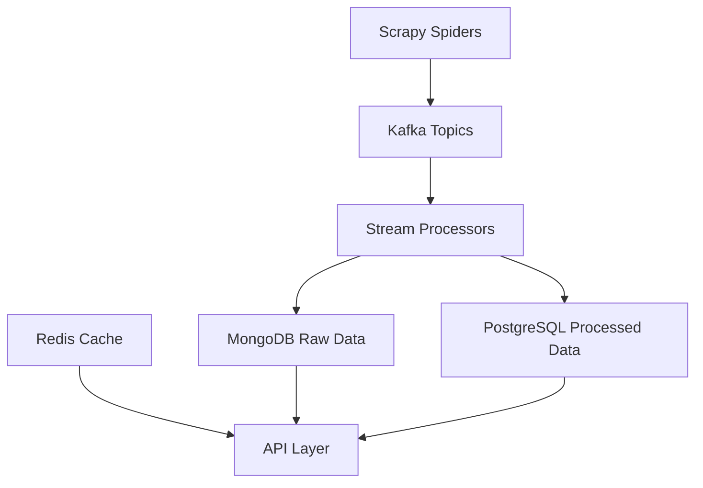

# Application Flow

## Data Pipeline Flowchart

## Flow Explanation

1. **Data Collection**
   - Scrapy spiders collect data from various sources
   - Collected data is sent to Kafka topics for processing

2. **Stream Processing**
   - Kafka topics distribute data to stream processors
   - Stream processors perform data transformation and enrichment

3. **Data Storage**
   - Raw data is stored in MongoDB for flexible schema storage
   - Processed data is stored in PostgreSQL for structured querying
   - Redis is used for caching frequently accessed data

4. **Data Access**
   - API layer provides access to both raw and processed data
   - Redis cache improves API response times for frequently accessed data